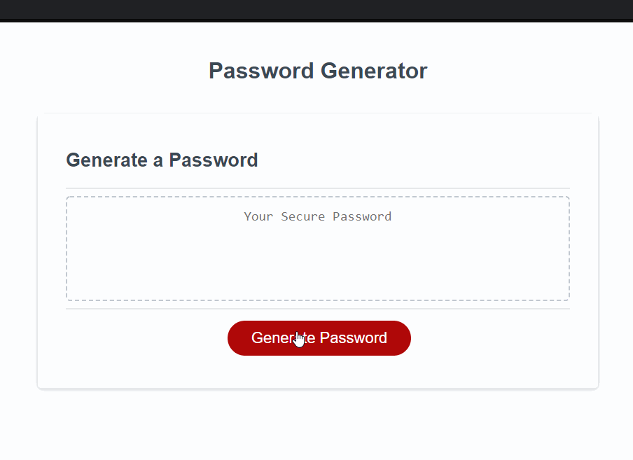

This application uses JavaScript to generate a random password based on user input.
Users can choose how long they want their password to be as well as if the want uppercase letters, lowercase letters, special characters and numbers.
# Link to Deployed Application
******
<a href="https://graysondeese.github.io/PasswordGenerator/">Password Generator</a>
******
A demonstration of the working application can be found below:

